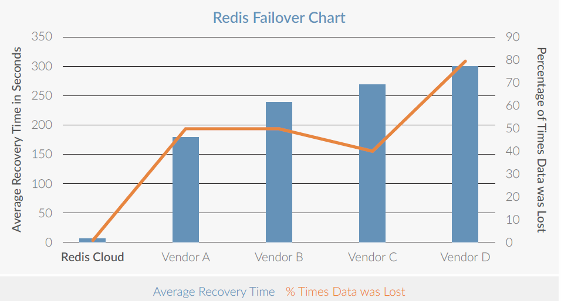
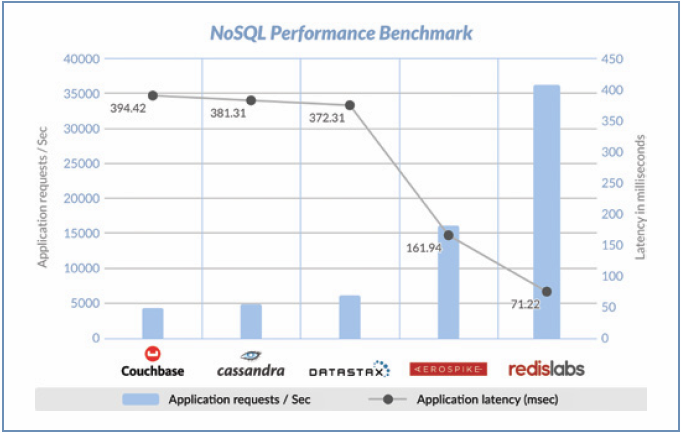

:lang: ja
:doctype: book
:sectnums: 
:chapter-label:
:toc:
:toclevels: 3
:hardbreaks:
:toc-title: 目次
:figure-caption: 

= Radis Enterprise Pack
== demo項目追加
== 前提と目的
=== 定義
Redis(e)   = Redis Enterprise
Radis      = Original Redis 
Redis Labs = Redis , Memcachedの商用ソフトの開発・サポートを提供する会社
https://redislabs.com/redis-enterprise-documentation/viewing-cluster-metrics/redis-pack-metrics/[Documentation - Redis(e) Pack]

=== 前提
Redis LabsのRedis製品ラインは以下2つ

* Redis(e)Pack
** インストール型のソフトウェアであり、エンタープライズグレードの高可用性 スケーラブルなRedisクラスタを実現
** プライベートPaaSに対応（IBM BlueMix、Pivo​​tal CloudFoundryとRedHat OpenShift)
** メインメモリの拡張にフラッシュメモリを利用可能とする。（FusionIOなど？） 

* Redis(e)Cloud 
** 完全に管理された、可用性の高いクラウドサービス
** 対応クラウド：AWS／Google Cloud／Microsoft Azure／IBM Softlayer
** 対応PaaSプロバイダ（Heroku、 OpenShift、IBM Cloudなど）

=== 目的
今回は [underline]*Redis(e)Pack* について、Redisとの機能差異について概要を述べる

== Raids(e)Packの特徴
Radis Enterprise は通常のRidesと比べ以下の特徴が存在する
#いずれもRedisに無い特徴・パフォーマンスとなる#

. クラスタリング機能の強化（高可用性、クラウド対応）
. 自動スケーリング（負荷分散）
. スループット／レイテンシの向上
. 設定・管理・監視のためのUI／RestAPI／Cmdを提供
. 24x7サポート

=== クラスタリング機能の強化
RedisClusterはサポートしておらず完全に独自のクラスタリング技術となる。
Redisではver3.0よりCluster（マスタ／スレーブ）機能が追加されたが、それまでは単一ノード(プロセス)で稼働するキャッシュシステムであり、冗長化を図るには利用するアプリケーション側で考慮をする必要があったがこれらがサーバサイドへ移行している。
具体的には
[option="header"]

|===
|Redis|Redis(e)Pack
a|
* シャーディングしたデータベースへのエンドポイントがそれぞれあり、値がない場合、エラーと別エンドポイントが返却されるため、それを利用して再度接続要求を行う
* 改善としては、事前にハッシュスロットとノードの対応をクライアント側でキャッシュし、それをもとに、要求するエンドポイントを決定する。
ちょっと古い
http://redis.shibu.jp/admin/cluster/[http://redis.shibu.jp/admin/cluster/]
a|
* Redis(e)Packにより管理され、エンドポイントとクラスタ（各ノード）は同じに存在する必要はなく、マスターエンドポイントへの要求を０レイテンシプロキシによって必要に応じてシャードいｎRedis操作を転送する。
Redis(e)Pack-Doc
https://redislabs.com/redis-enterprise-documentation/system-architecture/node/[https://redislabs.com/redis-enterprise-documentation/system-architecture/node/]
|===

Redis Labsでは更に、クラウド内のリージョン（地域）間でのクラスタリングが可能であり遅延が少なく競合の無いレプリケーションされたデータのコピーが可能。更に専用に開発された障害検出メカニズムによるMTTRの短縮が特徴

※Append Only File：データ永続化機構でありデータ更新履歴を収めたファイル

[underline]*特徴*

* データセンター・リージョン・クラウド間をまたぐ複数ノード間のインメモリレプリケーションの自動化
* 高速な障害検出メカニズムによるスプリットブレイン時の自動フェールオーバー
* AOFデータでの永続性。マスタースレーブ両方から有効化(復旧)可能。
* クラスタ内のノード数が不均等な場合でのデータコピー
* 圧縮・除外・TCP最適化によるWAN超えの複製ギャップを最小限に抑えるレプリケーション（高レイテンシ・低スループット回線）

参考：フェールオーバー時のダウンタイム比較（秒）

Redis(e)CloudはMTTRは約6秒であり、他は150秒～300秒程度
RedisE, MS Azure Cache, AWS ElasticCashe, Heroku Redis, Compose.io(最左以外は順不同)

=== 自動スケーリング
ダウンタイムが無く・パフォーマンスの低下もなくシャードの追加が可能。それらはすべてがUIもしくはAPIから操作可能。
また、RAMDisk(メインメモリ）のほか、Flashメモリ（FusionIO等？）での利用も可能。
xref:anchor-2[noisy neighbor]（うるさい隣人問題）回避のため、パフォーマンスは監視を通じて最適化され、スループットや待ち時間の閾値によりスケールアウトを実施可能。

=== スループット／レイテンシ向上
150万IO/Sec,msecでの応答レイテンシが可能。（単一のAWS EC2 server）
Radisとの明確な数値比較データは無いが、Redis(e)Packにはxref:anchor-1[Redis Module API]を利用した「RediSearch」という高性能検索エンジンが搭載されており、これが性能を向上させている一員であると推測する。
RediSearchは以下の特徴を備えている。
WP-RedisLabs-RediSearch-103-Web.pdf

*特徴*
* インデックスの作成と検索
* メモリ効率を意識したRAM上のデータ構造のカスタム
* UTF-8の
* ステミングでのクエリ拡張・正確なフレーズ検索
* 特定のプロパティによる結果のフィルタリング（タイトルのみの検索 "foo"など）
* 強力な自動提案エンジン
* インクリメンタルなインデックス作成（インデックスを最適化または真空化する必要なし）
* 別のデータベースに格納されているドキュメントの検索インデックスとしての使用をサポート すでにredisにある既存のHASHオブジェクトの索引付けをドキュメントとしてサポート
* 複数のRedisインスタンスへのスケーリング

=== 管理・設定用のUI/API/CLIの提供とメトリクス監視
以下の主要メトリクスを管理可能
[cols="2,3,5" , option="header"]
|===
a|Ops/秒
|1秒あたりの合計操作数
|操作の意味：
    1 読み取り操作
    2 書き込み操作
    3 他のコマンド操作

a|読み取り/秒|1秒あたりの読み取り総数|例えばget
a|書き込み/秒|1秒あたりの総書き込み数|例えば設定する
a|他のcmds|1秒あたりのその他のコマンドの数|例：PING、Auth、INFO
a|レイテンシ|1操作あたりの待ち時間|グラフには、平均値、最小値、最大値、最後の値も表示されます
a|レイテンシを読み込む|読み取り操作あたりの待ち時間|グラフには、平均値、最小値、最大値、最後の値も表示されます
a|レイテンシを書き込む|書き込み操作あたりのレイテンシ|グラフには、平均値、最小値、最大値、最後の値も表示されます
a|その他のcmdsレイテンシ|他のコマンドごとの待ち時間|グラフには、平均値、最小値、最大値、最後の値も表示されます
a|使用メモリ|RAM、フラッシュ（有効な場合）、複製（有効な場合）など、データベースによって使用される合計メモリ。|注 - 使用メモリには次のものは含まれません。
1. 断片化オーバーヘッド
2. マスタのスレーブレプリケーションバッファ
3. Luaスクリプトによって使用されるメモリ
4. COW（Copy On Write）操作は、次の方法でトリガーできます。
完全な複製プロセスが開始されます。
データベーススナップショットプロセスが開始されます。
AOF書き換え処理を開始する
a|メモリ制限|`used_memory`で強制される、データベースのメモリサイズ制限です。|注 - 使用メモリには次のものは含まれません。
1. 断片化率
2. レプリケーションバッファー - `used_memory`の` auto_slavebuf_ratio`％です。デフォルトの `auto_slavebuf_ratio`は10％です。デフォルトでは `auto_slavebuf_min`と` auto_slavebuf_max`は `64MB`と` 2048MB`ですが、これは両方向で決して超えません。
3. 2つの閾値を有するLuaメモリ限界：
Luaメモリが0.5GBを超えたときに起動されるガベージコレクションのしきい値
Luaが決して交差しないハード1GBの1GB"
a|メモリ使用量|`used_memory` /` memory_limit`として計算されます。|
a|合計キー|データセット内のキーの総数（レプリケーションを有効にしていない場合でも、レプリケーションは含まれません）|
a|ヒット率|`number_of_ops_on_exsiting_keys` /` total_ops`として計算されます。|すべてのマスターシャードのすべてのキーの合計として計算されます。
a|接続|データベースにアクセスするために使用された接続の数。|
a|書き込みミス/秒|非exsitingキーの書き込み操作の数（1秒あたり）|このメトリックは、ユースケースのキャッシュに関連します。
a|読み取りミス/秒|非exsitingキーの読み取り操作の数（1秒あたり）。|このメトリックは、ユースケースのキャッシュに関連します。
a|期限切れオブジェクト/秒|1秒あたりの期限切れオブジェクトの数。期限切れのオブジェクトは、データベースから削除された期限切れのTTLを持つオブジェクトです。|これは、ユースケースのキャッシュに関連します。
"a|||
Redisは、2つの期限切れメカニズムを実装しています。

1. Lazy expiry - オブジェクトへのアクセスごとにRedisは最初にオブジェクトがTTLを調べて既に期限切れになっているかどうかをチェックし、 'はい'の場合はRedisがそれを削除します
2. アクティブ期限 - レディスは常にランダムキーを選択し、期限が切れている場合は削除します"

a|消滅したオブジェクト/秒|1秒あたりに退去されるオブジェクトの数。|追放プロセスは、次の場合に実行されます。
1. データベースはそのmemory_limitに達します。
2. 追放政策は追放を許す。すなわち、「退去しない」ように構成されていない
3. データセットキーは、選択されたエビクションポリシーに準拠しています。例えばvolatile-lru evictionポリシーは、侵害されたキーにのみ適用されます。すなわち、TTLが設定されています。"
a|着信トラフィック|データベースへの着信トラフィックの合計（バイト/秒）。|
a|発信トラフィック|データベースからの総発信トラフィック（バイト/秒）|
|===

=== 価格
問い合わせ中・・・

=== 考察
以下採用ケースの考察
特にデータロストに対してシビヤな部分についてはResi(e)PackでのClustringによって多重化と高パフォーマンスを担保する必要と考える。

. いずれもFusionI/Oなど高速なフラッシュメモリを利用することで、高スループット・低遅延でありながら、データロストの可能性を限りなく低くした構成が可能となる。

. 表示用時価情報のキャッシュ
　ハッシュテーブルを用いて、銘柄に帰属する各エレメントを銘柄コードと市場をキーで持ち、マルチキャストグループを意識したクラスタリング・シャーディングを行った上でスケールしていく。
　永続機能により、断面の保存・復旧・任意の上書きなど現在のInfoServerより高度な運用が可能

. セッション管理
　サーバーパーシステンスに依存するアプリから、RESTFullなAPIの適用、CSRF対策によるメンテナンス時のユーザー利便性の低下を排除できる可能性がある。

. 残高のリアルタイム評価
　LUAによるスクリプトによって、時価更新時のリアルタイム評価その計算コストのRedisへのオフロードなどに利用できる可能性がある。

. SysDic/Membership/SystemDay等のキャッシュ
　そのまま置き換えがきくほど構想・ケースがそのまま当てはまる。
　ただ現状スループット・レイテンシともに問題にはなっていない

. キュー
　調べ中

. 障害・メンテナンス等でのRedisダウン時の運用
　最もポイントとなると考える。アプリケーション構成とインフラ構成（サーバ構成とネットワーク構成）の複雑性・コストについて、トレードオフしていく必要がある。
　汎用的なVMware上の仮想環境を利用していく場合、FusionI/Oと言った高価なフラッシュメモリは利用しづらい。
　永続化機能でのデータ復旧か、マスタとなるDB（RDB）を作っておきそこを起点にするのかなど。
　NetLibに依存していることからそちらの機能見直しを行う必要もある。

== Appendix
=== Radisとは？

*Radis それは危険なほどのスピード*

*概要*
https://redislabs.com/ebook/foreword/[Redis in action]
https://www.slideshare.net/yujiotani16/redis-26851700[図解入りでわかりやすい。Redis勉強会資料（2015/06 update）]

* redisはOSS(BSDライセンス)のインメモリKVS。（最新はRedis 3.2.8)
* remote dictionary serverの略で開発者はSalvatore Sanfilippoさん
* ANSI Cで書かれておりデータIOが非常に高速に行える。
* RedisはシングルスレッドでのIOとなりCPU１コアのみ利用
* 文字列・ハッシュ・リスト・セットなどのデータ構造を格納できる
* データ操作は、アトミックな操作・トランザクション操作が可能
* 永続化機能は、「Append Only File」と「スナップショット」がある
 . Append Only File
    キャッシュデータの変更の履歴をすべてディスクへ出力する（完全同期or1秒間隔or操作完了時）
 . スナップショット
    指定された期間内の書き込み数に達した場合にディスクに圧縮して書き込む
* 冗長化・スケールアウト機能は、クラスタリング(3.0.0)による「レプリケーション」「シャーディング」
* パブリッシュサブスクライブ、Luaスクリプト（ストアドプロシージャ）
* 言語サポート、Ruby、Python、Twisted Python、PHP、Erlang、Tcl、Perl、Lua、Java、Scala、Clojure、C#(河合さんのBookSleeve）

=== Redis のユースケース
* キャシュ
Redis を別のデータベースの「フロント」に配置して、パフォーマンスの高いインメモリキャッシュを作成することにより、レイテンシーを減少させ、スループットを増大し、リレーショナルデータベースや NoSQL データベースの負荷を軽減します。

* セッション管理
Redis はセッション管理タスクに非常に適しています。セッションキーに適切な TTL を設定して Redis を高速キー値ストアとして使用することで、セッション情報を管理します。ゲーム、e コマースウェブサイト、ソーシャルメディアプラットフォームといったオンラインアプリケーションでは、一般的にセッション管理が必要になります。

* リアルタイムリーダーボード
Redis の Sorted Set データ構造を使用すると、要素がスコア順にソートされた状態でリストに維持されます。このため、ゲームの勝者を表示することや、最も「いいね」を集めたメッセージを投稿すること、その他リーダーを表示させるどのような用途でも、動的なリーダーボードを簡単に作成できます。

* レート制限
Redis ではイベントのレートを測定でき、必要な場合には調整することも可能です。クライアントの API キーに関連付けられた Redis カウンターを使用することで、特定の期間内のアクセスリクエスト数をカウントでき、制限を超えた場合にはアクションを実行できます。レートリミッターは、フォーラムの投稿数制限、リソース利用制限、スパム発信者の影響抑制に広く利用されています。

* キュー
Redis の List データ構造を使えば、軽量かつ持続的なキューを簡単に実装できます。List ではブロッキング機能に加えてアトミック操作が提供されているため、信頼性の高いメッセージブローカーや循環リストを必要とするさまざまなアプリケーションに適しています。

* チャットとメッセージング
Redis では、パターンマッチングを備えた PUB/SUB 標準がサポートされています。これにより、Redis では高性能のチャットルーム、リアルタイムのコメントストリーム、サーバー間通信などをサポートできます。PUB/SUB を使用すれば、公開イベントに基づいてアクションをトリガーすることもできます。

== Amazon Elastic Cacheとの比較

* Redis Labs great alternative to AWS Elastic Cache
http://www.cloudadmins.org/2016/07/redis-labs-great-alternative-to-aws-elastic-cache/   

. シャードのノード数の上限の差異
　AEC=２０ノード（マスタ）3.55TBメモリ　x 5ノードReadレプリカ
　Redis(e) Cloud 1000ノードマスタという記述あり（無制限という記述も）

. シャーディングによる水平分散のアーキテクチャ
　AECは標準Redisに準拠していることからシャーディングによる水平分散はClient依存となる。
　またAECは基本的にマスター／スレーブによるレプリケーション。
　Redis(e)Cloudはシャーディングによる水平負荷分散かつユニークエンドポイントでの接続が可能
　※Redisはシングルスレッド（シングルCore)前提であり、Management機能を拡張したRedisCloudが優位と考える。

. Redis(e) Labs はそもそもRedis本業であり、Reids開発者であるSalvatore Sanfilippoさん在籍
　今後の機能拡張・バグフィックス・サポートにおいて優位

. ベンチマーク（ALTOROS)
Redis Cloud vs. ElastiCache vs. openredis vs. RedisGreen vs. Redis To Go
https://blog.altoros.com/performance-benchmark-rediscloud-elasticache-openredis-redisgreen-redistogo.html
特に複雑な操作（複数Keyのソートとその和集合の算出）でのパフォーマンスに圧倒的な差がでている。
単純なSET/GETのパイプライン処理でも太のRedis as a Serviceを圧倒。

* Amazon Virtual Private Cloud (Amazon VPC) with ElastiCache
http://docs.aws.amazon.com/AmazonElastiCache/latest/UserGuide/AmazonVPC.html

* Replication: Multi-AZ with Automatic Failover (Redis)
http://docs.aws.amazon.com/AmazonElastiCache/latest/UserGuide/AutoFailover.html

* Amaozon Elastic Cache Scalling
http://docs.aws.amazon.com/AmazonElastiCache/latest/UserGuide/Scaling.html

=== Memcachedと比較し
https://yakst.com/ja/posts/3243[Redisの作者antirez氏自らによる、memcachedとRedisの長所短所の比較]
* クラスタリングにおけるレプリケーション（Memcachedはクライアントライブラリが書きたいデータと書きたいノードを決定し、データのレプリは行わない。）
* 永続化（DiskWrite）
* Valueへの文字列以外のデータ格納
* 監視のしやすさ
* 単一スレッドでのメモリI/O
* Luaスクリプティング（ストアド）

=== Redis Module API [[anchor-1]]
Redisモジュールは、外部モジュールを使用してRedis機能を拡張し、新しいRedisコマンドを実装し、コア内部で実行可能な機能と同様の機能を実現する。
文字列APIではRedis DMAにより、メモリ上のポインタを用いて直接メモリデータの参照・更新を可能としてる。
https://github.com/antirez/redis/blob/unstable/src/modules/INTRO.md[Redis Module API]

=== http://blogs.itmedia.co.jp/hatori/2016/10/post_4.html[うるさい隣人問題][[anchor-2]]
仮想化マシンでは特に大規模なDB処理などが一斉に行われたりしますと、ストレージへの短時間でのアクセスが急増し、他の仮想マシンのレスポンスの急低下やレイテンシ増大などが実際に生じるケースが非常に増えることになってしまいます。ERPなどは仮想化マシンに移行するとサーバーの管理面やコストパフォーマンス面で優位性があることから実行する企業も増えていますが、いざ使い始めてみると想像をはるかに超えるほどパフォーマンスが上がらないという問題に直面することも目立ちはじめています。

また、最近多くの企業が仮想デスクトップ環境を利用しはじめ、ホームワーカーなどに対応した環境構築に取り組み始めていますが、朝の始業時に一斉に従業員がPCを機動することによりブートストームと呼ばれるサーバーやストレージに負荷がかかって処理が追い付かなくなる状況も見られるようになっています。さらにウイルス対策ソフトの定期的なスキャニングやセキュリティパッチの一斉適用などが実施される場合にもストレージI/Oの競合からパフォーマンスが著しく低下する問題が現れるようになってきているのです

== 参考
* Documentation - Redis(e) Pack
https://redislabs.com/redis-enterprise-documentation/viewing-cluster-metrics/redis-pack-metrics/

* redis 2.0.3 documentation - Redisのクラスタリング
http://redis.shibu.jp/admin/cluster/

* Redis in action
https://redislabs.com/ebook/foreword/

* DOCUMENTATION - REDISe PACK - A guide to Redise Pack installation, operation and administration
https://redislabs.com/redis-enterprise-documentation/system-architecture/node/

* Redis勉強会資料（2015/06 update）
https://www.slideshare.net/yujiotani16/redis-26851700

* https://yakst.com/ja/posts/3243
Redisの作者antirez氏自らによる、memcachedとRedisの長所短所の比較

* Redis Module API
https://github.com/antirez/redis/blob/unstable/src/modules/INTRO.md

* 仮想環境における「うるさい隣人」問題
http://blogs.itmedia.co.jp/hatori/2016/10/post_4.html

